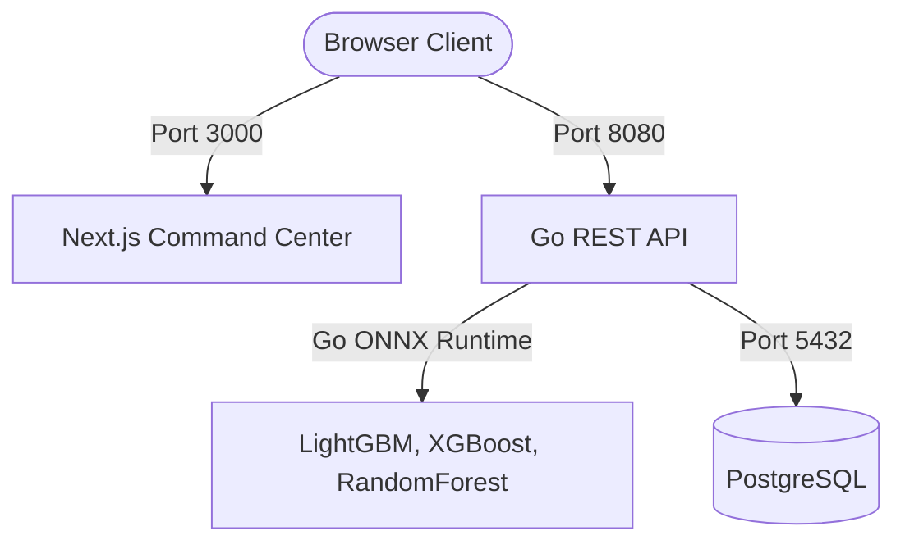

# 🛡️ ParkIntel — Intelligent Illegal Parking Hotspot Predictor

ParkIntel is an end-to-end intelligent illegal parking hotspot prediction and enforcement dispatch system. It consists of a high-fidelity Next.js command center frontend, a high-performance Go REST API backend serving live-inferred ML model predictions (using ONNX models), and a PostgreSQL database.

---

## 🏗️ System Architecture



---

## 📂 Repository Layout

```
ParkIntel/
├── docker-compose.yml          # Coordinates all Docker services (Frontend, Backend, DB)
├── README.md                   # System-wide guide (this file)
├── backend/                    # Go REST API backend
│   ├── Dockerfile              # Docker recipe for Go service with ONNX C-library
│   ├── main.go                 # App entry point
│   ├── schema.sql              # Database schema script
│   └── README.md               # Backend developer guide
├── frontend/                   # Next.js App Router frontend
│   ├── Dockerfile              # Docker recipe for Next.js app
│   ├── app/                    # Next.js pages & styling
│   ├── components/             # Reusable UI widgets & command center panels
│   └── README.md               # Frontend developer guide
├── models/                     # ML Model storage
│   └── onnx/                   # ONNX binaries (LGB, XGB, RF) & class metadata
└── ml-python/                  # Python notebooks, preprocessing & training scripts
```

---

## 🐳 Quick Start: Running Everything via Docker (Recommended)

Running the entire stack with Docker Compose handles database initialization, data ingestion, ONNX shared library bindings, and Next.js building out-of-the-box.

### Prerequisites
* **Docker** installed and running on your system.
* **Docker Compose** installed (typically bundled with Docker Desktop).

### 1. Build and Start the Stack
Run the following command from the root directory of the project:
```bash
docker compose up --build -d
```

This single command will:
1. Initialize a PostgreSQL 16 database container.
2. Build the Go API container, download the prebuilt ONNX Runtime C library (`libonnxruntime.so.1.27.0`), and compile the Go code.
3. Build the Next.js frontend container.
4. Mount the models and training CSV datasets into the containers to seed the database and load ONNX sessions at startup.

### 2. Verify Running Services
Run the following to check if all services are healthy and running:
```bash
docker compose ps
```

You should see:
* **parkintel-db**: Up and healthy (port `5432`).
* **parkintel-backend**: Up (port `8080`).
* **parkintel-frontend**: Up (port `3000`).

### 3. Check App Access
* **Frontend Dashboard**: Open [http://localhost:3000](http://localhost:3000) in your browser.
* **Backend Health Check**: Run `curl http://localhost:8080/health` (should return a healthy status JSON).

### 4. Stop the Services
To stop and clean up the container stack without losing database volume data:
```bash
docker compose down
```
To remove the volume data as well, run `docker compose down -v`.

---

## 💻 Manual Setup & Local Running (Without Docker Compose)

If you prefer to run services manually for debugging or active development:

### 1. Database Setup
Start a PostgreSQL container:
```bash
docker run --name parkintel-postgres -e POSTGRES_DB=parkintel -e POSTGRES_USER=postgres -e POSTGRES_PASSWORD=postgres -p 5432:5432 -d postgres:16-alpine
```

### 2. Run the Backend REST API
Ensure you have Go installed (1.25+) and set `ONNX_RUNTIME_LIB_PATH` to an installed `libonnxruntime` shared library. Production containers bake this library into `/usr/lib`; local development can point at the Python venv copy if you have installed `ml-python/requirements.txt`.

Navigate to `backend/` and run:
```bash
# Create local .env file
cp .env.example .env

# Run tests
go test -v ./...

# Run backend service
go run main.go
```
The backend will boot on port `8080` and run migrations & CSV data ingestion.

### 3. Run the Frontend Command Center
Ensure you have Node.js 18+ installed.

Navigate to `frontend/` and run:
```bash
# Create local .env.local file
cp .env.local.example .env.local

# Install dependencies
npm install

# Run next.js in dev mode
npm run dev
```
Open [http://localhost:3000](http://localhost:3000) to view the dashboard.

---

## 🛠️ Developer Configurations & Git Tuning

### Large Model File Pushes
Since ONNX models are large binary files (~82MB uncompressed), Git pushes may sometimes fail over HTTPS due to network limits. Run these commands locally to optimize Git configuration:
```bash
git config http.postBuffer 524288000
git config http.lowSpeedLimit 0
git config http.lowSpeedTime 999999
git config http.version HTTP/1.1
git config core.compression 0
```

### Git Force Pull for Teammates
If teammates experience difficulties or branch mismatches when pulling code updates from the remote repository, they can perform a hard reset and force-align with the remote `main` branch:
```bash
git fetch origin main
git reset --hard origin/main
```
*(Warning: This will discard any uncommitted local changes.)*
